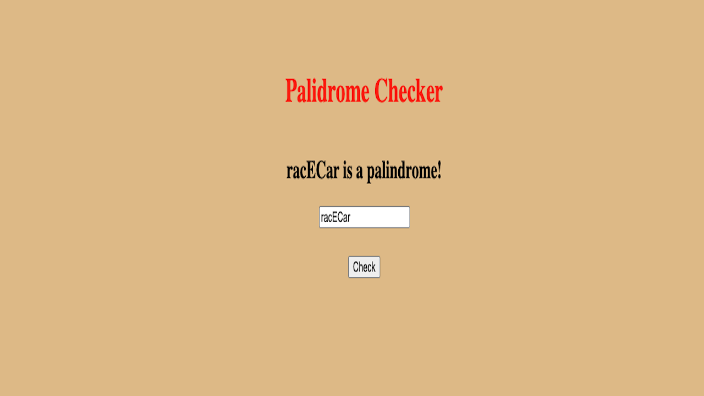

# 🔄 Node.js Palindrome Checker

**Node.js Palindrome Checker** is a simple web application built in Node.js, HTML, and CSS that checks whether a given string is a palindrome. It processes user input and returns a response indicating if the input is the same when reversed (ignoring spaces, punctuation, and case).

---

## 🧠 About The Project

The **Node.js Palindrome Checker** allows users to input a string through a simple web interface. It checks if the string reads the same backward as forward, ignoring spaces, punctuation, and case. The app provides a responsive design with real-time feedback on whether the input is a palindrome.

### 🛠️ Built With

- **HTML** – Structure of the web page  
- **CSS** – Styling and layout of the web interface  
- **JavaScript** – Logic for checking palindrome and DOM manipulation  
- **Node.js** – Backend to handle processing the palindrome check  
---

## 📸 Screenshot

---

## 📄 License

Distributed under the MIT License. See `LICENSE` for more information.

---

## 📬 Contact

**Azeez Olaosebikan**  
[GitHub](https://github.com/ozazeez)  
[LinkedIn](https://www.linkedin.com/in/azeezolaosebikan)

